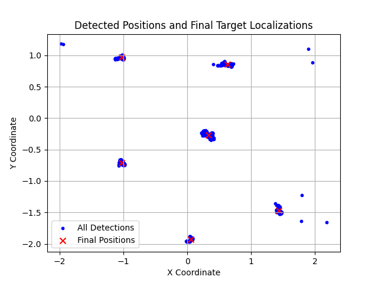

# Lab 3 — Object Detection and Geo-Localization

**Group 2**

## Overview

Detect and geo-localize six physical ground targets using a Parrot AR.Drone's downward-facing camera. The drone flies autonomously while recording images; the perception pipeline processes those images offline to estimate each target's inertial (X, Y) position.

## Approach

**Pipeline:**
1. **Undistort** each frame using calibrated camera intrinsics
2. **HSV segmentation** — isolate green circle targets using color thresholding
3. **Contour filtering** — reject non-circular or undersized blobs by area and fill ratio
4. **Back-projection** — convert each 2D pixel detection into a 3D inertial ray using the drone's pose (position + quaternion from `lab3_pose.csv`) and the camera-to-body extrinsic transform
5. **Ground intersection** — intersect each ray with the z = 0 ground plane to get candidate (X, Y) coordinates
6. **K-means clustering** — group all detections into 6 clusters (one per target)
7. **RANSAC refinement** — robustly estimate each target's final position by rejecting outlier detections per cluster

## Results



Six targets localized from ~2,900 frames of drone footage.

## Files

| File | Description |
|------|-------------|
| `AER1217_Lab3_code_Group2/lab3_demo_group2.py` | Full detection + localization pipeline |
| `AER1217_Lab3_code_Group2/lab3_pose.csv` | Drone pose log (position + quaternion per frame) |
| `AER1217_Lab3_code_Group2/all_detections.csv` | Raw back-projected (X, Y) detections across all frames |
| `AER1217_Lab3_code_Group2/final_positions.csv` | Final estimated (X, Y) for each of the 6 targets |
| `AER1217_Lab3_code_Group2/final_positions.png` | Plot of final target positions |
| `AER1217_Lab3_report_Group2.pdf` | Submitted report |
| `2024_AER1217_Lab3-1.pdf` | Lab instructions |

> **Note:** The raw image dataset (`output_folder/`, ~2,900 frames) is excluded from this repo due to size.

## Dependencies

```
pip install opencv-python numpy scikit-learn matplotlib
```
