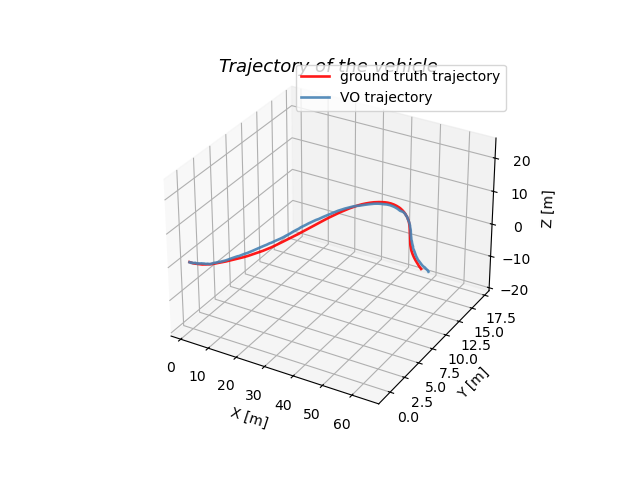

# Lab 4 — Stereo Visual Odometry

**Group 2**

## Overview

Implement a stereo visual odometry (VO) pipeline and evaluate it on the KITTI driving dataset. The system estimates the 6-DOF camera trajectory using only successive stereo image pairs — no GPS, no IMU.

## Approach

**Pipeline:**
1. **Feature detection** — SIFT keypoints and descriptors on each stereo image pair
2. **Stereo matching** — cross-match features across left/right images using descriptor distance; filter by epipolar constraint (vertical pixel difference < threshold) and disparity bounds
3. **Temporal matching** — match features across consecutive frames to find 4-way correspondences (prev-left, prev-right, cur-left, cur-right)
4. **3D triangulation** — reconstruct each matched point into 3D for both the previous and current frames using stereo geometry
5. **RANSAC** — reject outlier correspondences (2000 iterations, 0.3 m inlier tolerance)
6. **SVD alignment** — compute the best-fit rigid transform (R, t) from inliers using singular value decomposition; enforce det = +1 to guarantee a valid rotation
7. **Pose accumulation** — chain local transforms into a global trajectory T_hist
8. **Evaluation** — compare estimated trajectory to KITTI ground truth, report mean and final position error

## Results



## Files

| File | Description |
|------|-------------|
| `code_repo/lab4.py` | Main driver — loads data, runs VO loop, plots trajectory |
| `code_repo/stereo_vo_base.py` | `StereoCamera` + `VisualOdometry` classes |
| `code_repo/ground_truth_pose.mat` | KITTI ground truth poses |
| `code_repo/VO_T.npy` | Saved estimated trajectory (NumPy array) |
| `code_repo/Traj.png` | Trajectory plot — VO vs ground truth |
| `AER1217_Lab4_Group2.pdf` | Submitted report |
| `2025_AER1217_Lab4_VO.pdf` | Lab instructions |

> **Note:** The KITTI image dataset (`CityData/`) is not included — it is an external dataset available from [cvlibs.net/datasets/kitti](http://www.cvlibs.net/datasets/kitti/).

## Dependencies

```
pip install numpy opencv-python scipy matplotlib
```

## Running

```bash
# Adjust image paths in lab4.py to point to your CityData/ directory
python code_repo/lab4.py
```
