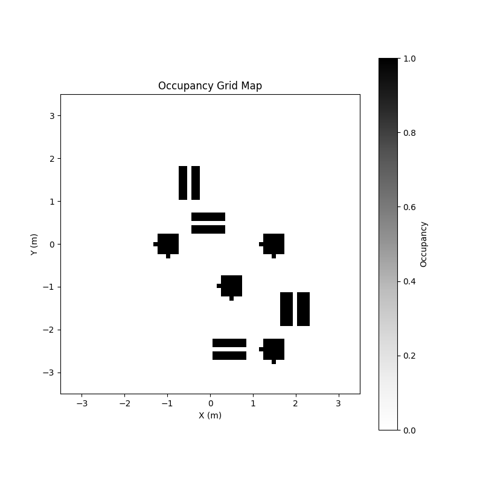
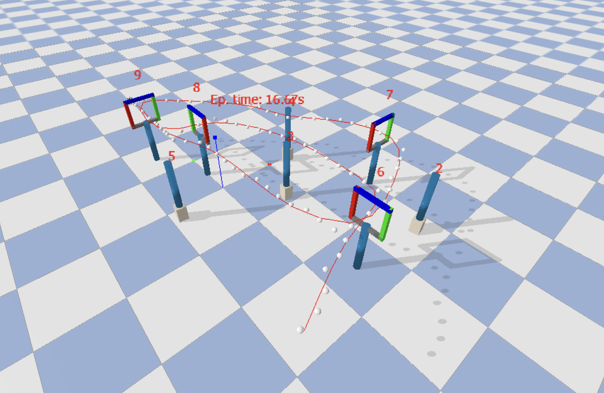
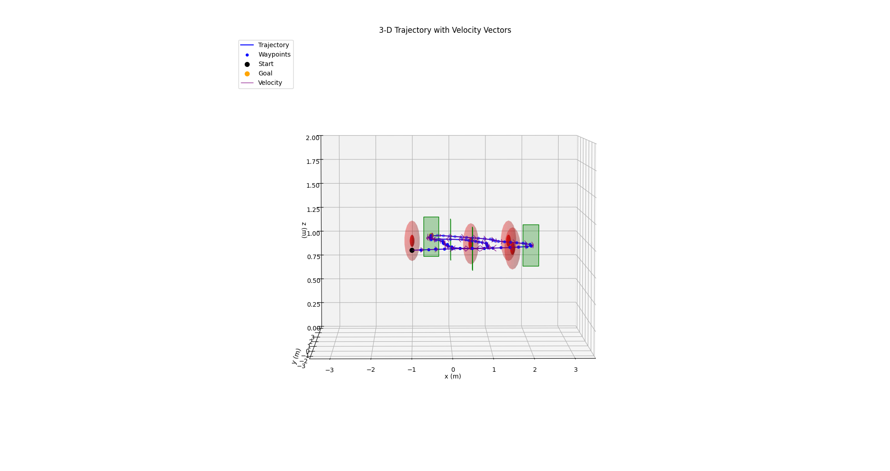

# Project — Autonomous Quadrotor Path Planning

**Group 2** | **Result: 1st place — fastest gate-to-gate time in the class competition**

## Overview

Plan and execute an autonomous flight path for a Crazyflie quadrotor navigating through a sequence of gates in PyBullet simulation. The goal is to find the fastest collision-free trajectory through all gates given a known map.

## Approach

- **Grid-based search** on a 3D occupancy map of the environment
- **Trajectory smoothing** to generate dynamically feasible waypoints between gates
- **Obstacle avoidance** using map-informed path constraints
- **Simulation-to-real transfer** — algorithm validated in PyBullet, then run on hardware

The algorithm achieved the **lowest gate-to-gate flight time** in the semester's live competition.

## Demo Videos

Real drone flight footage from the live competition:

- [Main angle — Group2_Trial3.MP4](Group2_Trial3.MP4)
- [Side angle — Group2_Trial3_Other_Angle.MOV](Group2_Trial3_Other_Angle.MOV)

## Results

| | |
|---|---|
|  |  |
|  |  |

## Files

| File | Description |
|------|-------------|
| `final_project.py` | Path planning algorithm — main implementation |
| `edit_this.py` | Entry point called by the simulator |
| `example_custom_utils.py` | Custom utility functions |
| `project_utils.py` | Shared utilities provided by course |
| `getting_started.yaml` | Environment configuration |
| `AER1217_Project_Group2.pdf` | Submitted report |
| `_aer1217_quad-path-planning.pptx` | Final presentation |
| `2025_AER1217_Project.pdf` | Project instructions |
| `Group2_Trial3.MP4` | Competition flight video (main angle) |
| `Group2_Trial3_Other_Angle.MOV` | Competition flight video (side angle) |

## Dependencies

```
pip install numpy pybullet scipy matplotlib
```
